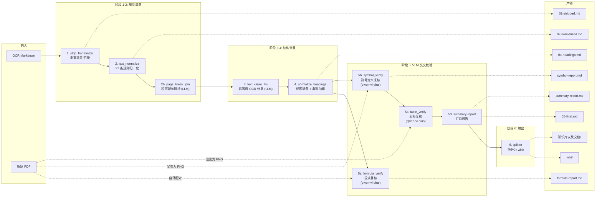

<p align="center">
  
</p>

<p align="center">
  <a href="https://www.python.org/"></a>
  <a href="./LICENSE"></a>
  <a href="#"></a>
  <a href="#"></a>
</p>

---

一套将商用 OCR 输出的工程规范 Markdown 自动清洗、校验、拆分到**结构化 Wiki 知识库**的后处理流水线。覆盖 **62 份建筑规范**，产出 **5200+ 个 wiki 页面**，支持多模态 VLM 交叉校验 PDF 原文，专攻**公式、符号定义、表格**三大类 OCR 错误。

## 目录

- [产物概览](#产物概览)
- [数据流](#数据流)
- [技术栈](#技术栈)
- [核心创新](#核心创新)
- [模块概览](#模块概览)
- [快速开始](#快速开始)
- [各阶段详解](#各阶段详解)
- [Wiki 知识库](#wiki-知识库)
- [实用脚本](#实用脚本)
- [关键路径](#关键路径)
- [已覆盖的 OCR 问题](#已覆盖的-ocr-问题)
- [常见问题](#常见问题)

---

## 产物概览

```
知识库以及文档/
├── {规范名}.md                     # 62 份规范完整正文（05-final）
└── wiki/{规范名}/
    ├── {规范名}-index.md            # 根索引：章节目录 + 各章摘要
    ├── 1总则/
    │   ├── 总则.md                  # 规范原文
    │   └── 总则-index.md            # 条款目录 + 逐条摘要 + 关联文件
    ├── 2术语和符号/
    ├── ...                          # 各正文章节
    ├── 附录A.../                    # 附录章节
    │   ├── {附录名}.md
    │   └── {附录名}-index.md
    └── ...
```

每个 `*-index.md` 包含：
- **章节目录**：可点击跳转到正文或子章节
- **各章节内容摘要**：从原文条款自动提取的关键信息（非占位符）
- **关联文件**：章节间交叉引用链接

---

## 数据流



**每阶段中间产物落盘**，可逐阶段 diff 追踪变化。

---

## 技术栈

| 层级 | 技术 | 用途 |
|---|---|---|
| **核心语言** | Python 3.10+ | 流水线编排、规则引擎、模块化架构 |
| **多模态 VLM** | Qwen-VL-Plus (FelizAI API) | 公式修正、符号定义修复、表格复核 |
| **文本 LLM** | Qwen3.6-Plus (FelizAI API) | 跨页断句拼接、段落级 OCR 清洗 |
| **PDF 渲染** | PyMuPDF (fitz) | PDF 页面渲染为 PNG（Dpi 200） |
| **规则引擎** | Python `re` (21 条正则) | 条款编号、页码标记、数值、标点、标题修正 |
| **API 客户端** | OpenAI SDK (兼容模式) | 统一的 LLM/VLM 调用接口 + 指数退避重试 |
| **Web UI** | Flask + SSE | 拖拽上传、实时进度、PDF↔MD 同步对照 |
| **断点续跑** | JSON Checkpoint | 每条处理即写盘，中断重跑不重复调 API |
| **输出格式** | Markdown + LaTeX + HTML | 公式→`$$...$$`、表格→`<table>`、符号→`$...$` |

---

## 核心创新

### 1. 多模态 VLM 交叉校验

不同于传统 OCR 后处理仅做规则替换，本系统**将 PDF 原文渲染为图片，连同 OCR 文本一起发给 VLM 逐条校对**，实现：

- **公式复核**：逐条对照 PDF 截图修正 LaTeX
- **符号定义复核**：检测 OCR 特有错误模式（如 `$f_{c0}$ o-描述` → `$f_{c0}$ —— 描述`），VLM 对照截图修正
- **表格复核**：逐张对照截图修正结构和数值

### 2. 结构化 Wiki 知识库

清洗后的规范自动拆分为层级化的 wiki 知识库，每个文件包含：

- **原文内容**：规范条款原文
- **条款索引**：自动提取的条款目录 + 一句话摘要
- **关联文件**：章节间交叉引用（如「与本节同属第 X 章的前序内容」「引用第 Y 节」）
- **章主页索引**：各章的技术主题摘要

### 3. 全流程可追溯

- **每阶段中间产物落盘**（`01-stripped.md` → `05-final.md`），每一步可 diff
- **每条 VLM 修正生成对比报告**（含原始/修正前后对比）
- **汇总报告**聚合修改统计：修正率、类型分布、逐条详情
- **Checkpoint 断点续跑**：中断即停，重跑即续，已完成条目不重复调用 API

### 4. 面向工程规范的领域定制

- **21 条中文工程规范 OCR 噪声规则**
- **标题层级智能折叠**：依据"真实编号"将任意层级标题归并
- **条款编号自动加粗**
- **跨页断句 LLM 拼接**
- **附录 slog 规范化处理**（LaTeX 截断、长度限制）

---

## 模块概览

```
ocr-postprocess/
├── pipeline.py                          # 流水线编排器（一键入口）
├── input/                               # 放入待处理的 .md + .pdf
├── FelizAI.png                          # FelizAI Logo
├── output/<规范名>/                      # 中间产物 + 报告（62 份规范）
│   ├── 01-stripped.md                   # 剥离前言/目录
│   ├── 02-normalized.md                 # 规则归一化
│   ├── 02b-page-joined.md               # 跨页断句拼接
│   ├── 04-headings.md                   # 标题折叠
│   ├── 04b-clause-bold.md               # 条款加粗
│   ├── 05-final.md                      # 最终清洗版
│   ├── formula-report.md                # 公式复核清单
│   ├── symbol-report.md                 # 符号定义复核清单
│   ├── table-report.md                  # 表格复核清单
│   ├── summary-report.md                # 汇总报告
│   ├── checkpoint.json                  # 断点续跑状态
│   └── wiki/                            # 拆分后的 wiki 页面
├── postprocess/                         # 核心模块
│   ├── config.py                        # API 配置
│   ├── checkpoint.py                    # 断点续跑引擎
│   ├── strip_frontmatter.py             # 阶段 1: 前言剥离
│   ├── text_normalize.py                # 阶段 2: 21 条正则规则
│   ├── page_break_join.py               # 阶段 2b: 跨页断句拼接 (LLM)
│   ├── text_clean_llm.py                # 阶段 3: 段落级 OCR 修复 (LLM)
│   ├── normalize_headings.py            # 阶段 4: 标题 + 条款处理
│   ├── formula_verify.py                # 阶段 5a: 公式 VLM 复核
│   ├── symbol_verify.py                 # 阶段 5b: 符号定义 VLM 复核
│   ├── table_verify.py                  # 阶段 5c: 表格 VLM 复核
│   ├── summary_report.py                # 阶段 5d: 汇总报告生成
│   └── splitter.py                      # 阶段 6: Wiki 拆分
├── scripts/                             # 运维脚本
│   ├── split_wiki.py                    # wiki 拆分核心逻辑
│   ├── fill_wiki_index.py               # 批量补全索引摘要 + 关联文件
│   ├── finish_all_specs.py              # 收尾：条款式重建 + 全量同步
│   ├── resplit_missing_wiki.py          # 缺章重拆
│   ├── audit_wiki_gaps.py               # 审计缺章/缺节
│   ├── fix_chapter_headings.py          # 标题修复
│   ├── fix_and_resplit.py               # 安全修复 + 重拆
│   └── gen_rubric_v2.py                 # 评测考纲生成
├── webui/                               # Flask Web 界面
│   ├── app.py                           # SSE 实时进度 + 上传
│   └── templates/
├── 知识库以及文档/                        # 最终知识库产出
│   ├── {规范名}.md                       # 62 份规范完整正文
│   └── wiki/{规范名}/                    # 结构化 wiki 拆分
└── README.md
```

---

## 快速开始

### 命令行

```powershell
# 1. 把待处理的 md（和对应的 pdf）放入 input/
copy raw\民用建筑设计统一标准.md              ocr-postprocess\input\
copy raw\GB 50017-2017 钢结构设计标准.pdf     ocr-postprocess\input\
#     ↑ PDF 名字和 md 一致即自动配对

# 2. 完整流水线（规则清洗 + VLM 校验 + 拆分）
python ocr-postprocess/pipeline.py

# 3. 只看报告不调 VLM（仅规则清洗 + 出复核清单）
python ocr-postprocess/pipeline.py --no-vlm

# 4. 开启 LLM 辅助（跨页断句拼接 + 段落级 OCR 修复）
python ocr-postprocess/pipeline.py --llm-clean

# 5. 只清洗不拆分
python ocr-postprocess/pipeline.py --skip-split

# 6. 全量补全 wiki 索引摘要并同步知识库
python scripts/fill_wiki_index.py --all --sync-kb
```

### Web UI

```powershell
pip install flask PyMuPDF requests
python ocr-postprocess/webui/app.py
# 浏览器打开 http://127.0.0.1:5000
```

功能：
- 拖拽上传 MD + PDF，自动配对
- 一键执行流水线，SSE 实时显示进度
- 已有 `output/` 结果一键加载查看
- **PDF ↔ MD 左右对照**：翻页 / 页码标记自动同步、阶段切换查看每步产出

---

## 各阶段详解

### 阶段 1: strip_frontmatter

找到第一个正文章节（`# 1 总则` / `## 1总 则` / `#### 1总则`……），丢弃之前所有前言/目录/版权内容。

### 阶段 2: text_normalize

覆盖 21 条中文工程规范常见 OCR 噪声的正则规则：

| 错误形态 | 处理 |
|---|---|
| `7.1.1 0` → `7.1.10` | 条款编号打散修复 |
| `1. $0\mathrm{m}^{3}$` → `1.0$\mathrm{m}^{3}$` | 数值在公式前被打散 |
| `3． $5\%$` → `3.5%` | 百分号被打散 |
| `$2.0m^{2}$ 、的` → `$2.0m^{2}$ 的` | 公式后多余标点 |
| `$25\mathrm{\;Pa}\;30\mathrm{\;Pa}$` → `…~30…` | 区间连接符丢失 |
| `<!-- ·7· -->` → `<!-- 7 -->` | 页码标记统一 |
| `1总 则` → `1 总则` | 标题内嵌空格 |

### 阶段 2b: page_break_join (可选 LLM)

检测被页码标记截断的句子，LLM 确认后拼接恢复。

### 阶段 3: text_clean_llm (可选 LLM)

规则归一化后仍存在的字形相近字、错误分词等段落级 OCR 乱码，逐段 + 上下文发给 LLM 做最小修复。

### 阶段 4: normalize_headings + 条款处理

将任意层级标题折叠为 `#`/`##` 两级，依据"真实编号"智能判断。同时清理 OCR 自带裸数字加粗、补充 `x.y.z` 条款编号加粗。

### 阶段 5: VLM 交叉校验

**5a. formula_verify** — 扫描全部 `$$...$$` 公式块，渲染对应 PDF 页为 PNG，VLM 逐条校对后回填修正。

**5b. symbol_verify** — 扫描全文 `$...$` 符号定义行，检测 OCR 字符重复 + 破折号丢失错误。

**5c. table_verify** — 扫描全部 `<table>...</table>`，VLM 逐张对照 PDF 修正。

**5d. summary-report** — 聚合修改统计和详情。

### 阶段 6: splitter

调用 `scripts/split_wiki.py` 将清洗后的 md 按章节结构拆分为 wiki 知识库页面。

---

## Wiki 知识库

### 目录结构

```
知识库以及文档/wiki/{规范名}/
├── {规范名}-index.md         # 根索引
├── 1总则/
│   ├── 总则.md               # 正文
│   └── 总则-index.md         # 条款目录 + 摘要
├── 2术语和符号/
│   ├── 2.1术语.md
│   ├── 2.1术语-index.md
│   ├── 2.2符号.md
│   └── 2.2符号-index.md
├── 3基本设计规定/
│   ├── 3.1一般规定.md
│   ├── 3.1一般规定-index.md
│   └── ...
├── ...
├── 附录A.../
│   ├── {附录名}.md
│   └── {附录名}-index.md
└── ...
```

### 索引文件特性

每个 `*-index.md` 文件包含三个部分：

| 部分 | 内容 | 示例 |
|------|------|------|
| **章节目录** | 该节下所有条款的可点击链接 | `### [7.6偏心支撑框架](7.6偏心支撑框架.md)` |
| **各章节内容摘要** | 从原文条款自动提取的关键信息 | `给出计算公式、验算步骤或判定规定。` |
| **关联文件** (正文 .md) | 章节间交叉引用 | `与本节同属第7章的前序内容` / `引用第3.6.1节` |

### 维护命令

```bash
# 全量刷新所有索引摘要 + 关联文件 + 同步知识库
python scripts/fill_wiki_index.py --all --sync-kb

# 单份规范刷新
python scripts/fill_wiki_index.py --spec "建筑地基基础设计规范" --sync-kb

# 审计缺章/缺节
python scripts/audit_wiki_gaps.py --only-issues

# 缺章重拆 + 同步
python scripts/resplit_missing_wiki.py --sync-kb
```

---

## 实用脚本

| 脚本 | 功能 |
|------|------|
| `split_wiki.py` | 核心：按章节结构拆分 MD 为 wiki 页面 |
| `fill_wiki_index.py` | 批量补全 `*-index.md` 摘要 + 关联文件 + 同步知识库 |
| `finish_all_specs.py` | 收尾：条款式重建 + 附录 slug 修复 + 全量同步 |
| `audit_wiki_gaps.py` | 审计 wiki 目录 vs parse 结构的缺失章节 |
| `resplit_missing_wiki.py` | 对比 parse 与 wiki 目录，缺失章节重拆分 |
| `fix_chapter_headings.py` | 修正 OCR 标题层级错误 |
| `fix_and_resplit.py` | 安全修复标题后重新拆分 |
| `gen_rubric_v2.py` | 生成 FelizAI 评测考纲 Excel |

---

## 关键路径

| 用途 | 路径 |
|------|------|
| 流水线入口 | `pipeline.py` |
| 规范输入 | `input/` |
| 中间产物 | `output/{规范名}/` |
| Wiki 拆分 | `output/{规范名}/wiki/` |
| 最终知识库 | `知识库以及文档/` |
| 规范全文 (知识库) | `知识库以及文档/{规范名}.md` |
| Wiki 拆分 (知识库) | `知识库以及文档/wiki/{规范名}/` |

---

## 已覆盖的 OCR 问题

| 问题 | 处理方式 |
|------|----------|
| 标题层级混乱（`#### 7室内环境`） | `normalize_headings` 折叠归并 |
| 页码标记变体（`<!-- ·7· -->`） | `text_normalize` 正则统一 |
| 条款编号打散（`7.1.1 0`） | `text_normalize` 正则修复 |
| 公式后多余标点（`$2.0m^{2}$ 、的`） | `text_normalize` 正则修复 |
| 区间连接符丢失 | `text_normalize` 正则修复 |
| 前言/目录/版权页残留 | `strip_frontmatter` 剥离 |
| 跨页断句碎片 | `page_break_join` LLM 拼接 |
| OCR 自带裸数字加粗（`**1**`） | `normalize_headings` 清理 |
| 条款编号未加粗 | `normalize_headings` 补加粗 |
| 符号定义 OCR 错误 | `symbol_verify` VLM 复核 |
| 公式 LaTeX 错误 | `formula_verify` VLM 复核 |
| 表格数据错误 | `table_verify` VLM 复核 |

---

## 常见问题

### API 连接失败 (SSL / Connection error)

默认 `trust_env=False`，绕过系统代理直连 API。若必须走代理：`set FELIZ_TRUST_ENV=1`。

### 断点续跑

公式/符号/表格复核每处理一条即写 `checkpoint.json`。中断后重新执行同一命令即可从断点继续，已完成条目不重复调用 API。

### 瞬时网络抖动

内置最多 5 次指数退避重试（2s → 4s → 8s → 16s → 60s），仍失败则稍后重跑。

### 索引 TODO 待补

若 wiki index 含 `TODO: 待LLM总结` 占位符，运行：

```bash
python scripts/fill_wiki_index.py --all --sync-kb
```

会从原文条款自动生成摘要并写回。
